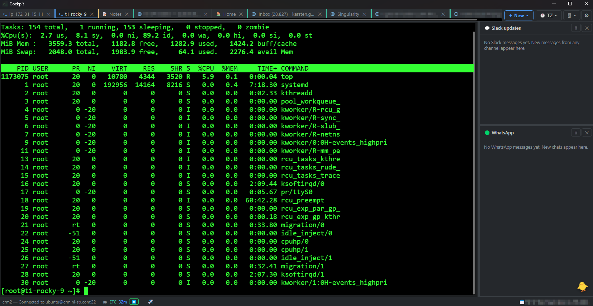
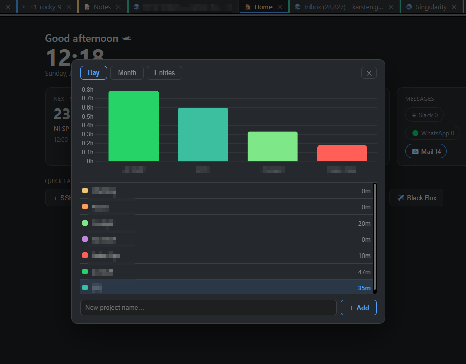
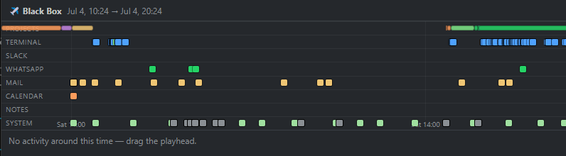
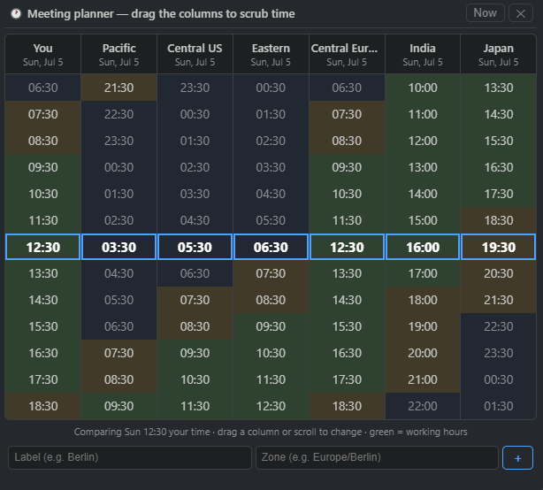
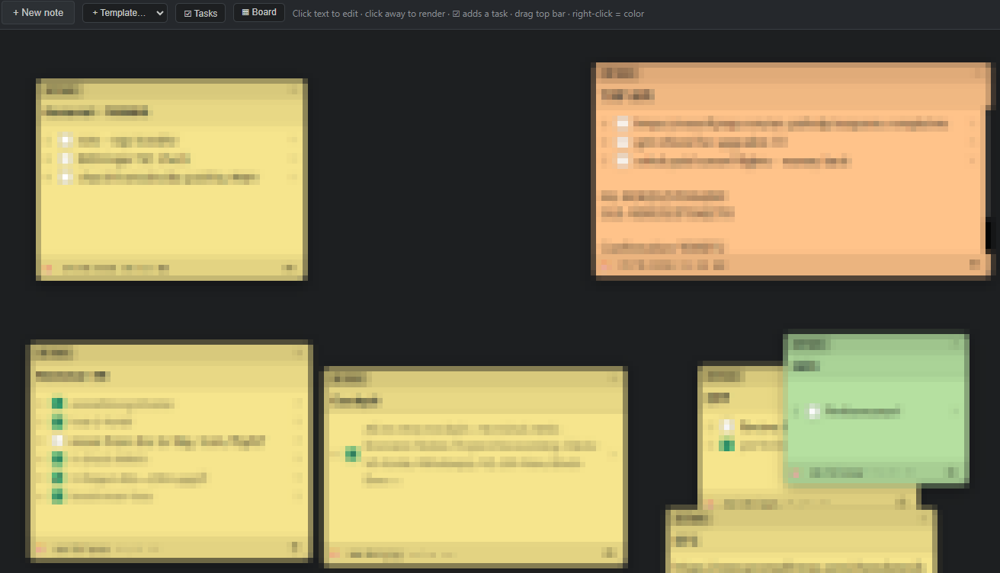

# Cockpit

**All-In-One Cockpit** - Terminal, Web Browser, Notes, Project Accounting, GMail/GCal,
Slack, WhatsApp, VS Code, TZ, 3D View, Black Box, …

A tabbed, colorful control center for Windows (and Mac/Linux) that puts all of it in one
window. Started life as a PuTTY-style SSH client (liked PuTTY, not MobaXterm): full
ANSI/256/truecolor, SSH-key auth.

## Screenshots

**Terminals** - full-color SSH/local tabs with the live message boards in the right sidebar:



**Command Deck + project accounting** - the home dashboard with the Day/Month time overview:



**Black Box** - a scrubbable timeline of your activity, with a project-time lane on top:



**Timezone meeting planner** and the **notes & tasks** board:





## Stack
- **Electron** - desktop shell (main / preload / renderer, context-isolated)
- **[xterm.js](https://xtermjs.org/)** - the terminal engine VS Code uses (true color, vim/htop/etc. render correctly)
- **[ssh2](https://github.com/mscdex/ssh2)** - pure-JS SSH client · **[node-pty](https://github.com/microsoft/node-pty)** - local shells
- **[Baileys](https://github.com/WhiskeySockets/Baileys)** - WhatsApp · **[@slack/*](https://slack.dev)** - Slack Socket Mode · **googleapis** - Gmail/Calendar
- **[three.js](https://threejs.org/)** - 3D Exposé · **[Chart.js](https://www.chartjs.org/)** - project-time charts · **[code-server](https://github.com/coder/code-server)** - in-tab VS Code

## Features

Everything lives in one tabbed window (`Ctrl+Shift+T` new · `Ctrl+Shift+W` close · `Ctrl+Tab` switch).

**Terminals**
- **SSH** - Windows OpenSSH **ssh-agent**, a **private key** (with passphrase), or **password** fallback; auto-detects keys in `~/.ssh` / `%USERPROFILE%\.ssh`. Full ANSI/256/truecolor, 10k scrollback, clickable links (open in an in-app web tab), live resize, PuTTY-style copy-on-select / right-click paste, font zoom (`Ctrl +/-/0`), scrollback search (`Ctrl+Shift+F`).
- **Local shell** tabs (PowerShell/cmd on Windows, `$SHELL`/zsh/bash on macOS/Linux) via a real PTY - same terminal UI, from **＋ New → Local terminal**.
- **Broadcast typing** (⇄ in the tab bar) - mirror your keystrokes from the focused terminal to every other connected ssh/local tab, so you run a command once and it lands everywhere. The button shows the member count; participating terminals get an orange badge, and any tab can opt out from its hover cheat-sheet.
- **Saved sessions** (host/port/user/key path) - secrets are never written to disk. **SSH auto-hop** optionally replays `ssh …` jump commands on connect (opt-in). Dropped session? **R** to reconnect, **P** to re-enter a passphrase.
- **`ssh://` link handler** (Settings → ssh:// links, opt-in) - register Cockpit as the system handler for `ssh://user@host:port` links, so clicking one anywhere opens a new terminal and connects. If a **jump / bastion host** is set (pick a **saved SSH session** from the dropdown, or type one), Cockpit connects there first and then runs `ssh user@host` to reach the target. Off by default; unchecking it hands `ssh://` back to your other tools.
- **Resilient SSH auth** - agent auth automatically **falls back to your `~/.ssh` keys** (like OpenSSH), so a stopped/empty agent isn't a dead end; a failing agent is a note, not a failed connection. (Cockpit uses the `ssh2` library, not the `ssh` binary.)
- Optional per-terminal **line numbers** for command output. **SFTP** file browser for the active SSH tab (drag-and-drop upload/download). New output **auto-scrolls** to the bottom (unless you've scrolled up to read history); `Ctrl+PageUp`/`Ctrl+PageDown` page the scrollback.
- **Record session → asciicast** (tab hover cheat-sheet → ⏺ Record session) - record a terminal to a standard **asciicast v2 `.cast`** file: the raw output stream is captured with timing, and on stop you're prompted to save. Replay it with `asciinema play file.cast`, embed a player, or convert it to a GIF - great for dropping a repro/how-to into a ticket or PR. The tab shows a pulsing red ● while recording; a 25 MB safety cap auto-stops runaway captures. Works on ssh and local tabs.
- **Time travel** (tab hover cheat-sheet → 🕰 Time travel) - Cockpit keeps a bounded rolling capture of every terminal's output, so you can **scrub the terminal backward through time** with a slider and see its exact **state at any past moment** - before that `clear`, before the deploy, "what did this look like 3 minutes ago." It replays the captured stream into a read-only terminal (so cursor moves / clears / colors reconstruct faithfully), with a live time label and a "▶ latest" jump. Live output keeps flowing in the real tab. Rolling window is ~4 MB per terminal.
- **Selection → note** (tab hover cheat-sheet → 🗒 Selection → note, or **Ctrl+Shift+N**) - select any terminal output and drop it straight into a sticky note, **auto-tagged** with the host, a timestamp, and **the command that produced it** (pulled from the tab's command tracker). The selection is stored fenced so it renders monospaced, and the note board opens and flashes the new note. Works on ssh and local tabs - handy for saving an error, a config snippet, or a one-off result you want to keep next to your tasks.
- **Grab / preview a file from here** (tab hover cheat-sheet → 📥 Get a file) - reaches a file straight through the current terminal session, so it works even inside a **nested `ssh`**, `sudo`, `tmux`, or a container where SFTP can't reach. Two options: **👁 Preview** shows the contents in a scrollable viewer (`.json` pretty-prints; **`.log`/`.out`/`.err` jump to the end** so you see the newest lines; binary files are declined), and **📥 Download** saves it. The transfer is hidden from the terminal (a short `[sending file …]` note stands in for the base64), leaving no clutter. Best for small/medium files; use SFTP for large ones.
- **Port forwarding** (tab hover cheat-sheet → 🔀 Port forwarding) - a visual SSH tunnel manager for the active connection. Port forwarding is confusing because it's hard to picture *who listens* and *which way traffic flows*, so each tunnel is drawn as a **three-node diagram** - your PC, the SSH host, the target - with a 📡 LISTENS pin and directional arrows, plus a plain-English sentence, and a live preview updates as you fill the form. Supports **Local (`-L`)** (reach an internal service from your machine), **Remote (`-R`)** (expose something of yours on the server), and **Dynamic (`-D`)** (a built-in SOCKS5 proxy). Each active tunnel shows a status dot, live connection count and bytes up/down, with a Stop button. Optionally **remember** a tunnel per host so it **auto-starts on connect**. An "allow other devices (0.0.0.0)" toggle exposes a local tunnel to your LAN. The panel is **draggable** by its header (double-click the header to re-center).
- **Host vitals** (Terminal ▾ → 📈 Host vitals, opt-in) - a tiny live CPU / MEM / DISK sparkline strip in the **status bar**, next to the active SSH shell's name, so you can eyeball a box's health without opening `htop`. Each host is polled over a **separate exec channel** (default every 15 s, selectable 5/15/30/60 s in the same menu), so it never disturbs your interactive shell. CPU is load1 ÷ cores; colours go green → amber → red as a metric climbs. **Hover** the strip for absolute figures (e.g. `MEM 29% of 33 GB (9.6 GB used)`, `DISK 82% of 500 GB`, plus load and core count). Linux-oriented (reads `/proc` + `df`); unavailable values show `n/a`.
- **Smart output** (Terminal ▾ → 🔎 Smart output, on by default) - makes things in the terminal scrollback clickable: click an **IP** (with optional `:port`) to open a pre-filled SSH connection, a **file path** to grab it through the current session, or a **JSON** object/array to pretty-print it in a copyable pop-up - this works on both compact single-line JSON and pretty-printed **multi-line** blocks (e.g. `cat file.json`), where clicking any line pops the enclosing object/array. URLs keep opening in an in-app web tab. IPs inside URLs are left alone; only text that actually parses as JSON gets a link. A `.json` file (a path, or a filename in an `ls -l` row) **previews structured** immediately (fetched in-band, with a Save button in the viewer). Filenames in an `ls -l` listing are grabbable too.
- **Actionable output** (part of Smart output) - Cockpit also recognises **things you act on** in terminal output and gives them a verb menu on click: a **PID** (in `ps aux`/`ps -ef`) → info / tree / lsof / renice / kill; a **container id** (in `docker ps`) → logs / inspect / stats / exec / stop / restart; a **systemd unit** (anything ending `.service` / `.socket` / `.timer` / `.target` / `.mount`) → status / journal / restart / stop / start. **Read-only** verbs (green) run immediately; **mutating** verbs are typed at your prompt so you review and press Enter.

**Command Deck (🏠 Home)** - a live dashboard tab (**＋ New → Home**): greeting + clock, the **next meeting** with a one-click **Join**, **today's project time** (start/pause + Projects shortcut), **open/overdue tasks**, unread **Slack/WhatsApp/Mail** counts, and a **quick-launch** row for every tab type. Refreshes every second.

**Tabs & window**
- Drag to **reorder**, **double-click a tab title to rename**; tabs persist and reopen in place across restarts. **Empty start** with quick actions instead of a forced dialog. **Command palette** (`Ctrl+L`, fuzzy jump/run). Resizable **right sidebar** (drag the dividers).

**Web browser** - `<webview>` tabs with bookmarks, back/forward/reload, **Ctrl/Cmd+wheel zoom**, **find in page** (`Ctrl/Cmd+F`), open-in-external, DevTools (`F12`), and unpacked Chromium **extensions**. Right-click selected page text → **capture to a note**.

**VS Code** - launch a full **[code-server](https://github.com/coder/code-server)** VS Code in a tab; auto-installs on first use (macOS/Linux) and relaunches a restored VS Code tab on startup.

**Messaging** - **Slack** and **WhatsApp** as tabs *and* as live right-sidebar **boards** (latest messages across all channels/chats, click to jump). Slack via Socket Mode; WhatsApp via QR login (no API key). Capture any message to a note.

**Google** - **Gmail** inbox strip + **Calendar** bar with countdown, a **centered pop-up that raises the window for an imminent meeting** (with a one-click **Join**), and capture-email-to-note.

**Notes & tasks hub** - draggable sticky notes; Markdown checkboxes `[ ]`/`[/]`/`[x]` become a **Tasks dashboard** + **Kanban**; note **templates** (standup / incident / checklist); capture-to-note from terminals, Slack, mail, or web; run/open **action buttons** on `ssh …`/URL lines. A **Cockpit pet** 🐤 reacts to your open/overdue tasks.

**Project accounting** - a start/stop **time tracker per project** in the status bar (today's total, green ▶/⏸). An overlay with **Day/Month bar charts** (Chart.js), a project list, inline **rename**, and **move time between projects** (fix "forgot to switch") with **undo** (`Ctrl+U` / revert banner). Optional **auto-switch by tab**: assign a project to a tab and the timer follows your focus.

**Black Box** (`F4`) - a local, scrubbable **timeline** of your activity across every stream (commands, messages, mail, meetings, notes, tabs), plus a **project-time lane** you can drag-select to reassign past work. Drag the playhead to reconstruct a moment; click an event to jump back.

**3D Exposé** (`F3`) - a navigable **three.js** view of all tabs as live floating panels (orbit, move, rotate, zoom, Tab-cycle to front).

**Timezone meeting planner** (🕐) - side-by-side zone columns; drag to scrub a compared time and find a working-hours overlap.

**Mini-cockpit (PiP)** - an always-on-top glance window (next meeting + Join, tasks). **Reminders** - a configurable periodic overlay (text + interval).

**Focus Session** (＋ New → 🎯) - a whole-cockpit deep-work mode: pick a project + duration and Cockpit pins that project's timer, mutes Slack popups and the reminder overlay, dims the other tabs, runs a countdown HUD, and marks the Black Box. When the timer ends (or you hit End) it writes a **summary note** - planned vs actual time, tracked time, and the commands you ran - with a follow-up task.

**Privacy Curtain** (🕶 / `F9`) - one toggle blurs sensitive ambient content for screen sharing, demos, and screenshots: the Slack/WhatsApp/Mail boards, calendar, message logs, note titles/bodies, the URL bar, and tab titles. Terminal and web page content stay visible (that's what you're presenting).

**Cross-platform & private** - Windows / macOS / Linux. Secrets encrypted at rest (DPAPI / Keychain / libsecret); everything is local, no telemetry.

## Run
```powershell
npm install
npm start
```

The connection dialog opens on launch. Pick an auth method, fill in host/user, and Connect.

### Auto-restart launcher (keeps Cockpit running)
Instead of `npm start`, use the bundled launcher, which **relaunches Cockpit whenever it closes**
(handy so quitting - or a rare crash - brings it right back). Close the terminal window (or
`Ctrl+C`) to stop it.
- **Windows:** double-click **`Cockpit.cmd`**
- **macOS / Linux:** `./cockpit.sh`  (first time: `chmod +x cockpit.sh`)

## Updating
Cockpit runs from source, so updating is just a pull and a restart:
```bash
git pull
npm install     # only needed when dependencies changed
npm start       # or use the auto-restart launcher above
```
If you use the auto-restart launcher, quit Cockpit after `git pull` and it comes back on the new
version automatically.

### macOS quick-start (run from source)
Cockpit is a cross-platform Electron app and runs the same on macOS.

1. **Install Node.js LTS** (gives you `node` + `npm`):
   ```bash
   brew install node          # or download from https://nodejs.org
   node -v                    # confirm it's on your PATH
   ```
2. **Get the source** - unzip the bundle (or clone the repo), then `cd` into it:
   ```bash
   cd cockpit                 # the folder created by unzipping cockpit-src.zip
   ```
3. **Install dependencies and launch:**
   ```bash
   npm install
   npm start
   ```

The connection dialog opens on launch - pick an auth method, fill in host/user, and **Connect**.

macOS notes:
- **SSH agent auth** uses `$SSH_AUTH_SOCK` (vs. the OpenSSH named pipe on Windows). Launch
  `npm start` **from a Terminal** so the agent socket is inherited. Add your key first with
  `ssh-add ~/.ssh/id_ed25519` (macOS keeps keys in the keychain - `ssh-add --apple-use-keychain`).
  If the socket isn't set you'll get a clear error; **key-file auth always works**.
- Cockpit auto-detects keys in `~/.ssh` (`id_ed25519`, `id_rsa`).
- The first launch may prompt for **Local Network / accessibility**-style permissions only if you
  enable the automation port; normal use needs nothing special.
- The dock icon is the default Electron icon when running from source; it becomes the custom
  icon only in a packaged build.

### Linux (run from source)
Same three steps - install Node LTS via your package manager (or nodejs.org), then
`npm install && npm start`. SSH-agent auth uses `$SSH_AUTH_SOCK` as on macOS.

### Packaging a macOS app
`npm run dist` builds with electron-builder, but a macOS `.dmg`/`.app` must be built **on a Mac**
(or macOS CI). Unsigned builds are blocked by Gatekeeper on first open - right-click the app →
**Open**, or run `xattr -dr com.apple.quarantine /Applications/Cockpit.app`.

### Using the ssh-agent
Make sure the Windows OpenSSH agent is running and your key is added:
```powershell
Get-Service ssh-agent | Set-Service -StartupType Automatic
Start-Service ssh-agent
ssh-add $env:USERPROFILE\.ssh\id_ed25519
```

## Slack tabs
Click **Slack** in the tab bar to open a channel as a tab (read history + send messages,
real-time via Socket Mode). One-time Slack app setup:

1. Go to https://api.slack.com/apps → **Create New App** → *From scratch*, pick your workspace.
2. **Socket Mode** (left nav) → enable it. When prompted, generate an **App-Level Token** with
   the `connections:write` scope - this is your `xapp-…` token.
3. **OAuth & Permissions** → **Bot Token Scopes**, add:
   `channels:read`, `channels:history`, `groups:read`, `groups:history`,
   `chat:write`, `users:read`, `files:read` (to display image/file attachments).

   **DMs:** a *bot* token only sees DMs with the bot. To see **your own** DMs with
   other people, install with a **user token (`xoxp-`)** that has `im:read`,
   `im:history`, `mpim:read`, `mpim:history` (User Token Scopes), then paste that
   `xoxp-…` token instead of the bot token. Subscribe to `message.im` / `message.mpim`
   events for real-time DM updates.
4. **Event Subscriptions** → enable → **Subscribe to bot events**: `message.channels`
   (and `message.groups` for private channels). Save.
5. **Install App** to the workspace → copy the **Bot User OAuth Token** (`xoxb-…`).
6. In the app: **Slack** → paste the `xoxb-…` (Bot token) and `xapp-…` (App-level token) →
   **Connect** → pick a channel → **Open channel**.
7. Invite the bot to any channel you want to read: in Slack run `/invite @YourAppName`.

Tokens are stored encrypted at rest via Electron `safeStorage` (Windows DPAPI).

## Gmail + Calendar (Google OAuth)
An always-visible **Gmail strip** (recent inbox subjects) and a **Calendar bar** in the
status bar (next appointment with a countdown that **flashes 3 min before start until you
click to acknowledge**). Read-only. One-time Google setup:

1. **console.cloud.google.com** → create a project.
2. **APIs & Services → Library** → enable **Gmail API** and **Google Calendar API**.
3. **OAuth consent screen** → External → add your Google account under **Test users**.
4. **Credentials → Create credentials → OAuth client ID → Desktop app** → copy the
   **Client ID** and **Client secret**.
5. In the app: **⚙ Settings → Google** → paste Client ID + secret → **Connect & sign in** →
   a browser opens; approve the scopes (Gmail **modify** - read + move-to-Trash - and
   Calendar read-only).

Tokens (client id/secret + refresh token) are stored encrypted via `safeStorage`; the app
reconnects silently on later launches. Gmail refreshes every 2 min, Calendar every 5 min.

## WhatsApp
Turn on the **WhatsApp board** from the ＋ New menu, then **⚙ Settings → WhatsApp → Connect**
and scan the QR code with your phone (WhatsApp → *Linked devices* → *Link a device*). No API key -
it uses the unofficial multi-device protocol ([Baileys](https://github.com/WhiskeySockets/Baileys)),
so keep usage light. The login is stored locally in the data folder; **Disconnect & forget** wipes it.

## VS Code (code-server)
**＋ New → VS Code** opens a full VS Code in a web tab. On first use Cockpit auto-installs
[code-server](https://github.com/coder/code-server) (official installer) and runs it on
`127.0.0.1`. Shift-click the button to pick a folder; the choice is remembered and a restored
VS Code tab is relaunched on the next start. ⚠️ **macOS/Linux only** - on Windows, run
code-server inside **WSL**.

## Project accounting & Black Box
- **Project accounting** - the 🗂 status-bar widget is a manual **start/stop timer** for the
  current project (shows today's total; green ▶/⏸). Click it for the **Day/Month** overlay:
  bar charts, a project list (double-click to pick, hover to **rename** or **✕ delete** - a
  deleted project's time can be moved to another project or discarded), **＋ Add** a project,
  and **⇄ move time** between projects when you forgot to switch. Time is stored locally as
  timestamped segments, so a block can be reassigned later (also from the Black Box).
- **Entries tab** - correct the record by hand: **log a block of time** (project + start/end +
  optional **note**) even if the timer never ran, and **edit or delete** any past entry inline.
  Notes ("what did I do") show on the Black Box project bar. Overlaps are carved out so totals
  never double-count, and every change is undoable (`Ctrl+U`).
- **Auto-switch by tab** (opt-in, Settings → Project accounting) - assign a project to any tab
  from its hover panel ("Track time as") - **SSH, local, web pages, and VS Code** all work; when
  enabled, focusing that tab switches the running timer to its project. Tabs with no assigned
  project leave the current one running, and a stopped timer is never restarted just by switching
  tabs.
- **Track time in other apps** (opt-in, the 📊 toggle at the bottom of the Projects overlay) -
  while the timer is running, Cockpit samples the **foreground application** (VS Code, a browser,
  a PDF, …) every few seconds and attributes that time to the current project, so the **Apps**
  breakdown in the Day/Month tabs shows where the time actually went - even outside Cockpit. Idle
  time (no keyboard/mouse for ~90 s) is excluded. **Local only**, **app names only** by default
  (never window titles). Works on **Windows** and **macOS** (a lightweight background probe, no
  native module; on macOS the first run asks for the one-time **Automation** permission for System
  Events). Off until you opt in.
  - **detailed** (a second checkbox) keeps the active tab / open file from the window title and
    buckets it as **`app › context`** (e.g. `chrome › Gmail`, `Code › renderer.js`) for a much more
    useful breakdown. More granular but more sensitive - the context can contain page/doc names -
    so it's a separate opt-in, still local only. (Windows only; macOS never exposes the title, so it
    stays app-name-only there.)
- **🎁 Cockpit Wrapped** (the 🎁 button in the Projects overlay) - a **story-style animated recap**
  of your work (past **week / month / year**), built entirely from data you already have: hours
  tracked, top projects, top apps, commands run and on how many hosts, your top commands, your
  **power hour**, focus sessions + streak, and messages/meetings. Auto-advances like stories (click
  to move, arrows/space/Esc too), and the final card can be **saved as a shareable PNG** or copied
  as text. Command/message stats come from the Black Box, so they cover its retention window.
- **Black Box** (`F4`) - a passive, scrubbable **timeline** of everything you do (commands,
  Slack/WhatsApp, mail, meetings, notes, tab open/close). Drag the playhead to see what you were
  doing at any moment and click an event to jump to it. Recording + retention toggle in Settings;
  local only.
- **Projects lane on the Black Box** - your project time shows as colored bars on the timeline, so
  you can see exactly *when* each project was worked on. **Drag-select** a past block and assign it
  to the right project - the precise fix for "I forgot to switch projects" (also undoable with
  `Ctrl+U`).

## Automation (CDP remote debugging)
To let an external tool (e.g. Claude Code) drive the app for testing:
1. **⚙ Settings → Automation** → set a **Remote debugging port** (e.g. `9222`) → Save → **restart**.
2. On the same machine, the Chrome DevTools Protocol is now at `http://localhost:<port>`:
   - List targets: `http://localhost:9222/json/list` (the main window + each `<webview>`).
   - Connect with any CDP client (Playwright `chromium.connectOverCDP('http://localhost:9222')`,
     `chrome-remote-interface`, or Chrome's `chrome://inspect`).
   - In the **main window** target, `Runtime.evaluate` runs in the page's main world where the
     bridge `window.sshApi` is exposed - e.g. `window.sshApi.write(tabId, 'ls\r')` to type into a
     terminal, or read the xterm buffer; `<webview>` targets drive embedded web pages.

⚠️ Local-only (binds 127.0.0.1), but **anything on the machine can attach while it's on** - leave
the port blank to disable when you're not testing.

## Where data lives
Saved sessions, settings, notes, project times, and encrypted tokens live in the app's
`Cockpit` data folder (profiles only - no passwords/passphrases on disk):
- **Windows:** `%APPDATA%\Cockpit\`
- **macOS:** `~/Library/Application Support/Cockpit/`
- **Linux:** `~/.config/Cockpit/`

Older installs used an `ssh-gui` folder; on first launch Cockpit **migrates it automatically**
(copies it to the new location), so nothing is lost.

Secrets (Slack/Google tokens) are encrypted at rest via Electron `safeStorage` - DPAPI on
Windows, Keychain on macOS, the OS secret service (e.g. libsecret/kwallet) on Linux.

## Packaging
```powershell
npm run dist
```
Produces a portable `.exe` in `dist/` via electron-builder.
